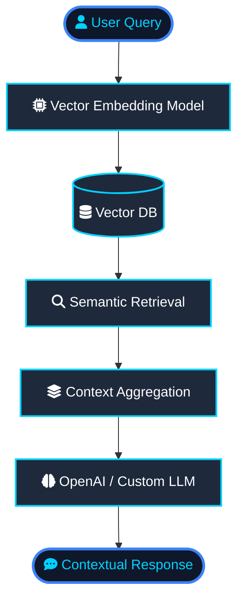

<div align="center">


<a href="https://git.io/typing-svg">
  
</a>

<br />


<br /><br />

<a href="https://www.linkedin.com/in/engr-ali-khan-626667251/" target="_blank">
  
</a>
<a href="mailto:alikhanse248@gmail.com">
  
</a>
<a href="https://alikhan-portfolio-app.netlify.app/" target="_blank">
  
</a>

</div>

---

##  About Me

I'm a software engineer from Pakistan, currently based in **Riyadh, Saudi Arabia**. I design and develop high-performance web, mobile, and AI-native applications.

 **Full-Stack Mastery** — I've built everything from microservices to sleek SPAs and cross-platform mobile apps.

 **AI Specialization** — Focused on production-grade **RAG systems**, semantic search, and automated AI pipelines.

 **Clean Architecture** — Deeply passionate about system design, performance optimization, and scalable databases.

---

##  Deep Dive: AI & RAG Engineering

I specialize in bridging the gap between large language models (LLMs) and custom enterprise datasets.



 **Vector Search & Indexing** — Building semantic retrieval systems using high-density vector embeddings.

 **Prompt Engineering & Orchestration** — Advanced reasoning workflows using LangChain, LlamaIndex, and custom agents.

 **Data Ingestion Pipelines** — Automated document parsing, chunking, and metadata indexing pipelines.

---

##  Specialized Tech Stack

<div align="center">
  <a href="https://skillicons.dev">
    
  </a>
  <br />
  <a href="https://skillicons.dev">
    
  </a>
</div>

<br />

| Layer | Technologies & Frameworks |
| :--- | :--- |
| **Frontend** |         |
| **Backend** |      |
| **Databases** |     |
| **AI & RAG** |       |
| **APIs & Auth** |     |
| **DevOps & Cloud** |       |
| **Architecture** |    |

---

##  What I Build

 **Web Apps** — Modern websites, dashboards, admin panels, LMS platforms, business portals, and full-stack web applications.

 **Mobile Apps** — Cross-platform mobile applications using React Native with clean UI, APIs, authentication, and real-world features.

 **RAG & AI Systems** — Intelligent search systems, document QA agents, and LLM-powered backends using Retrieval-Augmented Generation.

 **API Architectures** — Designing fast, secure RESTful and GraphQL APIs with OAuth & RBAC.

 **DevOps & Infrastructure** — Automated deployments using CI/CD pipelines, Docker, and AWS services.

---

##  Professional Experience

| Period | Role | Company | Highlights |
| :--- | :--- | :--- | :--- |
| **Mar 2024 – Present** | **Full Stack Software Engineer** | **Eradat AHQ Group (GST Riyadh)** | Production-grade MERN apps, secure REST APIs (JWT + RBAC), enterprise HR/inventory/reporting systems, AI-powered solutions with OpenAI, LangChain & RAG architecture. |
| **Feb 2023 – Jan 2024** | **Full Stack Engineer** | **CodeCrush Technologies** | Full-stack apps with React, Next.js, Node.js & TypeScript. API integrations, payment gateways, cloud services, and CI/CD pipelines. |
| **2022 – 2023** | **Junior Full Stack Engineer** | **ITSOLERA PVT LTD** | MERN stack development, REST APIs, production support, responsive UI, and backend integrations. |

---

##  GitHub Analytics

<div align="center">


<br />


<br /><br />


</div>

---

##  GitHub Trophies

<div align="center">
  
</div>

---

##  Developer Snapshot

```javascript
const aliKhan = {
  role: "Full-Stack & Mobile Developer | AI & RAG Engineer",
  location: "Riyadh, Saudi Arabia",

  frontend: ["React.js", "Next.js", "React Native", "TypeScript", "JavaScript", "HTML5", "CSS3", "Tailwind CSS"],
  backend: ["Node.js", "Express.js", "NestJS", "Python", "PHP"],
  databases: ["MongoDB", "PostgreSQL", "MySQL", "Vector Databases"],
  aiAndRag: ["OpenAI APIs", "LangChain", "RAG", "Semantic Search", "Vector Embeddings", "Prompt Engineering"],
  apisAndAuth: ["REST APIs", "JWT", "RBAC", "OAuth", "API Integration"],
  cloudDevOps: ["AWS", "Docker", "CI/CD", "Git", "GitHub Actions", "Vercel"],
  architecture: ["System Design", "Scalable Architecture", "Performance Optimization"],

  focus: "Building clean, scalable, AI-integrated, and high-performance applications"
};
```

---

<div align="center">


</div>
