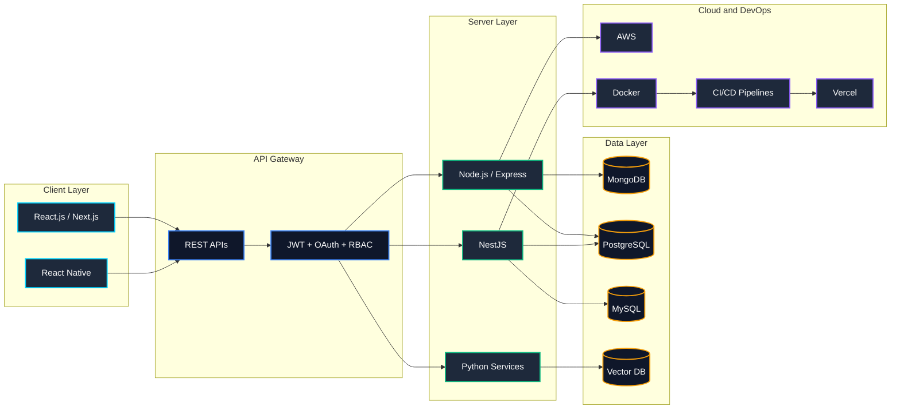

<div align="center">

[](https://git.io/typing-svg)


[](https://www.linkedin.com/in/engr-ali-khan-626667251/)
[](mailto:alikhanse248@gmail.com)
[](https://alikhan-portfolio-app.netlify.app/)

</div>

---

## 🧑‍💻 About Me

I'm a software engineer from Pakistan, currently based in **Riyadh, Saudi Arabia**. I design and develop high-performance web, mobile, and AI-native applications.

*   🌐 **Full-Stack Mastery** — I've built everything from microservices to sleek SPAs and cross-platform mobile apps.
*   🏗️ **System Architecture** — Designing scalable, maintainable systems with clean separation of concerns across frontend, backend, databases, and cloud.
*   ⚡ **Performance Obsessed** — Deeply passionate about query optimization, caching strategies, and delivering sub-second response times at scale.
*   🛡️ **PEC Registered** — Certified Professional Engineer registered with the **Pakistan Engineering Council (PEC)**.

---

## 🏛️ Full-Stack Architecture Overview

How I architect modern, production-grade applications end-to-end:



---

## 🛠️ Specialized Tech Stack

<div align="center">


</div>

<br />

| Layer | Technologies |
| :--- | :--- |
| **Frontend** |         |
| **Backend** |      |
| **Databases** |     |
| **AI / RAG** |       |
| **APIs / Auth** |     |
| **DevOps / Cloud** |       |
| **Architecture** |    |

---

## 🚀 What I Build

*   🌐 **Web Apps** — Modern websites, dashboards, admin panels, LMS platforms, business portals, and full-stack web applications.
*   📱 **Mobile Apps** — Cross-platform mobile applications using React Native with clean UI, APIs, authentication, and real-world features.
*   🤖 **AI-Powered Features** — Semantic search, document Q&A, and intelligent retrieval systems using RAG architecture.
*   ⚙️ **API Architectures** — Designing fast, secure RESTful and GraphQL APIs with OAuth and RBAC.
*   🐳 **DevOps and Infrastructure** — Automated deployments using CI/CD pipelines, Docker, and AWS services.

---

## 💼 Professional Experience

| Period | Role | Company | Highlights |
| :--- | :--- | :--- | :--- |
| **Mar 2024 – Present** | **Full Stack Software Engineer** | **Eradat AHQ Group (GST Riyadh)** | Production-grade MERN apps, secure REST APIs (JWT + RBAC), enterprise HR/inventory/reporting systems, AI-powered solutions with OpenAI, LangChain and RAG architecture. |
| **Feb 2023 – Jan 2024** | **Full Stack Engineer** | **CodeCrush Technologies** | Full-stack apps with React, Next.js, Node.js and TypeScript. API integrations, payment gateways, cloud services, and CI/CD pipelines. |
| **2022 – 2023** | **Junior Full Stack Engineer** | **ITSOLERA PVT LTD** | MERN stack development, REST APIs, production support, responsive UI, and backend integrations. |

---

## 🎓 Education

*   **Bachelor of Science in Software Engineering**
    *   **Institution:** Pakistan
    *   **Academic Performance:** CGPA **3.66 / 4.00**
    *   **Professional Certification:** Certified Engineer, **Pakistan Engineering Council (PEC)**

---

## 📊 GitHub Analytics

<div align="center">


<br />


<br /><br />


---

## 🏆 GitHub Trophies

<div align="center">


</div>

---

## 🧠 Developer Snapshot

```javascript
const aliKhan = {
  role: "Full-Stack & Mobile Developer | AI & RAG Engineer",
  location: "Riyadh, Saudi Arabia",

  frontend: ["React.js", "Next.js", "React Native", "TypeScript", "JavaScript", "HTML5", "CSS3", "Tailwind CSS"],
  backend: ["Node.js", "Express.js", "NestJS", "Python", "PHP"],
  databases: ["MongoDB", "PostgreSQL", "MySQL", "Vector Databases"],
  aiAndRag: ["OpenAI APIs", "LangChain", "RAG", "Semantic Search", "Vector Embeddings", "Prompt Engineering"],
  apisAndAuth: ["REST APIs", "JWT", "RBAC", "OAuth", "API Integration"],
  cloudDevOps: ["AWS", "Docker", "CI/CD", "Git", "GitHub Actions", "Vercel"],
  architecture: ["System Design", "Scalable Architecture", "Performance Optimization"],

  focus: "Building clean, scalable, AI-integrated, and high-performance applications"
};
```

---


