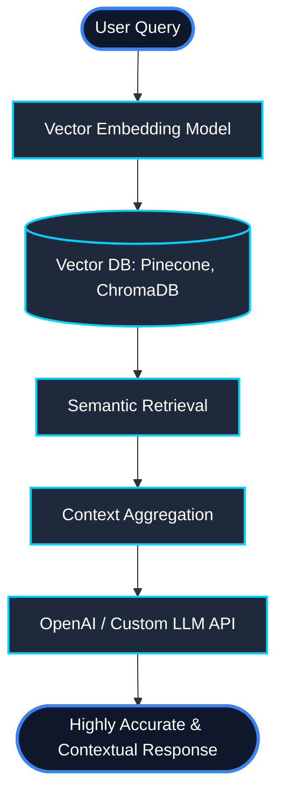

<div align="center">

# ⚡ Hi, I'm Engr. Ali Khan 👋

<a href="https://git.io/typing-svg">
  
</a>

<p align="center">
  
</p>

---

<p align="center">
  <a href="https://www.linkedin.com/in/engr-ali-khan-626667251/" target="_blank">
    
  </a>
  <a href="mailto:alikhanse248@gmail.com">
    
  </a>
  <a href="https://alikhan-portfolio-app.netlify.app/" target="_blank">
    
  </a>
</p>

</div>

---

## 👨‍💻 About Me

I'm a software developer from Pakistan, currently based in **Riyadh, Saudi Arabia**. I design and develop high-performance web, mobile, and AI-native applications. 

*   🌐 **Full-Stack Mastery**: Over the years, I've built everything from microservices to sleek SPAs and mobile apps.
*   🤖 **AI Specialization**: Focused on building production-grade **Retrieval-Augmented Generation (RAG)** systems, semantic search engine integrations, and automated AI pipelines.
*   ⚡ **Clean Architecture**: Deeply passionate about system design, performance optimization, and scalable databases.

---

## 🤖 Deep Dive: AI & RAG Engineering

I specialize in bridging the gap between large language models (LLMs) and custom enterprise datasets.



*   **Vector Search & Indexing**: Building semantic retrieval systems using high-density vector embeddings.
*   **Prompt Engineering & Orchestration**: Implementing advanced reasoning workflows using LangChain, LlamaIndex, and custom agents.
*   **Data Ingestion Pipelines**: Creating automated document parsing, chunking, and metadata indexing pipelines.

---

## 🛠️ Specialized Tech Stack

<div align="center">
  <a href="https://skillicons.dev">
    
  </a>
</div>

<br />

| Layer | Technologies & Frameworks |
| :--- | :--- |
| **Frontend** |         |
| **Backend** |      |
| **Databases** |     |
| **AI & RAG** |       |
| **APIs & Auth** |      |
| **DevOps & Cloud** |       |
| **Architecture** |    |

---

### ⚡ Skills & Services

*   🚀 **Full-Stack Web Apps**: End-to-end development of custom web portals, CMS, and admin dashboards.
*   📱 **Cross-Platform Mobile Apps**: High-performance mobile solutions built with React Native.
*   🤖 **AI & RAG Systems**: Integrating semantic search, custom knowledge retrieval pipelines, and vector DBs.
*   ⚡ **API Architectures**: Designing fast, secure RESTful and GraphQL APIs with OAuth & RBAC.
*   🐳 **DevOps & Infrastructure**: Automated deployments using CI/CD pipelines, Docker, and AWS services.

---

### 📊 GitHub Analytics

<p align="center">
  
  
</p>

<p align="center">
  
</p>

---

### 🏆 GitHub Trophies

<p align="center">
  <a href="https://github.com/ryo-ma/github-profile-trophy">
    
  </a>
</p>

---

### 🧠 Developer Snapshot

```javascript
const aliKhan = {
  role: "Full-Stack & Mobile Developer | AI & RAG Engineer",
  location: "Riyadh, Saudi Arabia",

  frontend: ["React.js", "Next.js", "React Native", "TypeScript", "JavaScript", "HTML5", "CSS3", "Tailwind CSS"],
  backend: ["Node.js", "Express.js", "NestJS", "Python", "PHP"],
  databases: ["MongoDB", "PostgreSQL", "MySQL", "Vector Databases"],
  aiAndRag: ["OpenAI APIs", "LangChain", "RAG", "Semantic Search", "Vector Embeddings", "Prompt Engineering"],
  apisAndAuth: ["REST APIs", "JWT", "RBAC", "OAuth", "API Integration"],
  cloudDevOps: ["AWS", "Docker", "CI/CD", "Git", "GitHub Actions", "Vercel"],
  architecture: ["System Design", "Scalable Architecture", "Performance Optimization"],

  focus: "Building clean, scalable, AI-integrated, and high-performance applications"
};
```
